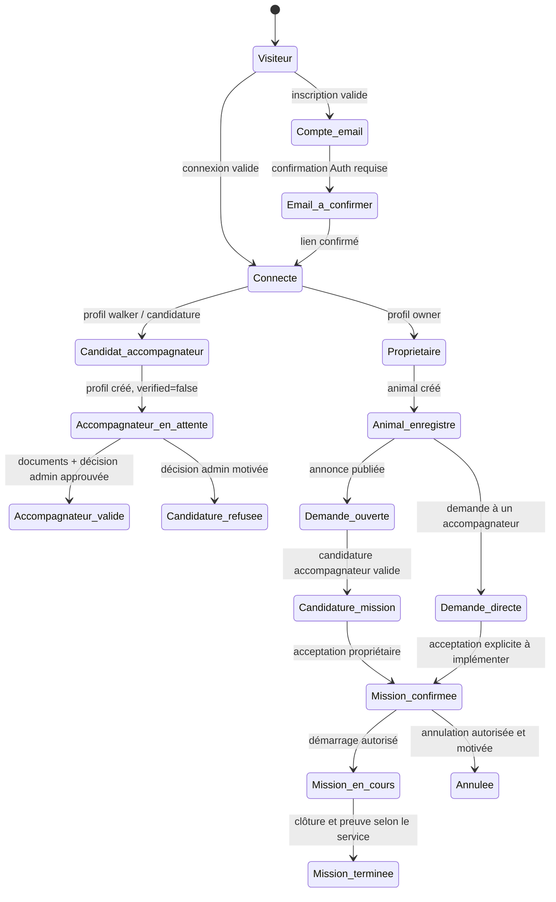

# DogWalking — Matrice exhaustive des parcours utilisateurs contrôlés

**Version :** 1.0 — 27 août 2026  
**Périmètre :** Propriétaire, Accompagnateur et Administrateur de contrôle.  
**Principe :** ce document distingue le **flux actuellement observable** du **flux à autoriser avant publication**. Une action ne doit jamais être décrite comme active si elle n’est pas soutenue par une donnée, un contrôle d’accès et une décision traçable.

> **Règle de publication.** Une demande, une candidature, une validation documentaire ou une mission ne progresse que si son état précédent, les droits du demandeur et les données obligatoires ont été contrôlés. Les paiements intégrés, séquestres, remboursements automatisés et commissions ne font pas partie du flux autorisé aujourd’hui.

## 1. Légende et règles transversales

| Marqueur | Sens opérationnel |
|---|---|
| **ACTIF** | Comportement implémenté, observé dans le code ou validé sur les données QA. |
| **CONTRÔLÉ** | À autoriser uniquement si les conditions listées sont satisfaites. |
| **BLOQUÉ** | Action qui doit être refusée dans l’état actuel. |
| **ÉCART** | Interface ou code présent mais incohérent, incomplet ou non publiable en l’état. |

Tous les comptes commencent dans l’état **visiteur**. Une authentification par email/mot de passe est implémentée ; une adresse déjà utilisée est détectée sans annoncer une création réussie. La récupération de mot de passe est disponible. Les options Google et Apple apparaissent dans l’interface mais doivent être considérées **BLOQUÉES tant qu’elles n’ont pas été configurées et testées dans Supabase Auth**.[1]

Le modèle de rôle utilise `profiles.user_type` pour **Propriétaire** ou **Accompagnateur**, `user_roles` pour l’administrateur, et `walker_profiles.verified` comme verrou de validation opérationnelle de l’Accompagnateur. Les accès aux chiens et réservations ont été rejoués dans une matrice QA : Propriétaire concerné, Accompagnateur associé et Administrateur sont autorisés ; un tiers est refusé.[2]

## 2. Carte globale des états

## 3. Parcours complet Propriétaire

### 3.1 Découverte, inscription et accès

| ID | Déclencheur | Conditions / contrôles | Transition autorisée | Réponses et notifications | État |
|---|---|---|---|---|---|
| P-01 | Visite du site | Aucune | Accueil, services, profils, annonces, ressources légales | Aucune donnée personnelle créée | **ACTIF** |
| P-02 | « S’inscrire » ou action qui requiert un compte | Choix explicite du rôle Propriétaire | Formulaire d’inscription | Validation prénom, nom, email, téléphone optionnel, mot de passe (8 caractères, lettre et chiffre) | **ACTIF** |
| P-03 | Soumission d’un email nouveau | Validation de formulaire + réponse Supabase Auth | Création Auth + profil prévu par déclencheur | Confirmation email selon le réglage Auth ; ne pas laisser créer une mission avant confirmation si Auth l’exige | **CONTRÔLÉ** |
| P-04 | Soumission d’un email existant | `identities` vide ou erreur Auth | Refus de création de doublon | Message : connexion ou réinitialisation ; aucune modification de rôle | **ACTIF** |
| P-05 | Connexion | Identifiants valides | Tableau de bord Propriétaire ou URL de retour demandée | Redirection protégée | **ACTIF** |
| P-06 | Mot de passe oublié | Email syntaxiquement valide | Envoi de lien de réinitialisation | Lien vers `/auth/callback?reset=1` | **ACTIF** |
| P-07 | Connexion sociale | Fournisseur OAuth configuré et testé | OAuth puis retour application | Ne pas ouvrir tant que les fournisseurs ne sont pas configurés | **BLOQUÉ par défaut** |

### 3.2 Dossier animal : prérequis obligatoire

Avant une demande, le Propriétaire doit disposer d’au moins un animal dont il est propriétaire. Le tableau de bord autorise l’ajout, la modification et la suppression d’un animal avec les champs nom, race, âge, poids, taille, tempérament et besoins particuliers.[3]

| ID | Action Propriétaire | Contrôles obligatoires | Décision / résultat |
|---|---|---|---|
| P-10 | Ajouter un animal | Session active ; champs indispensables cohérents ; `owner_id = auth.uid()` | Animal créé, visible au seul propriétaire et aux participants autorisés d’une réservation concernée. |
| P-11 | Modifier un animal | Propriétaire de la fiche ; pas de réservation historique corrompue | Mise à jour autorisée ; journalisation recommandée pour les besoins importants. |
| P-12 | Supprimer un animal | Vérifier absence de mission active / demande ouverte associée | **À bloquer** si une demande ou mission active le référence ; sinon suppression confirmée. |
| P-13 | Publier sans animal | Aucun chien associé | Refus, redirection vers l’onglet animaux | **ACTIF** dans les deux parcours d’annonce. |

### 3.3 Recherche, consultation et demande directe à un Accompagnateur

Le site permet de consulter les profils et d’ouvrir une demande directe. Le formulaire de demande comporte quatre étapes : service, date/heure, animal, récapitulatif.[4]

| ID | Étape | Contrôles / données | Transition et réponse attendue |
|---|---|---|---|
| P-20 | Consulter un profil | Profil public disponible ; ne pas afficher téléphone, adresse précise ou coordonnées privées | Consultation des informations publiées par l’Accompagnateur. |
| P-21 | Choisir un service | Enum réel : `promenade`, `garde`, `visite`, `veterinaire` | Service sélectionné. Toute autre valeur est refusée. |
| P-22 | Renseigner date, heure, adresse et consignes | Date future ; format horaire ; adresse non exposée publiquement ; notes sans données excessives | Passage à l’étape animal. |
| P-23 | Garde ou visite à domicile | Date + heure + protocole de remise des clés | **CONTRÔLÉ :** le protocole doit être obligatoire. Les détails sensibles doivent être rendus visibles seulement dans la fenêtre de mission, jamais dans une annonce publique. |
| P-24 | Sélectionner un animal | Session active + animal appartenant au Propriétaire | Passage au récapitulatif. |
| P-25 | Aucun compte / aucun animal | Non connecté ou aucun animal disponible | Redirection Auth / tableau de bord animaux, sans création de réservation partielle. |
| P-26 | Soumettre la demande directe | Accompagnateur existant ; tarif indicatif renseigné ; données valides | Création d’une réservation `pending`, notification à l’Accompagnateur, redirection vers les réservations. Le prix est **indicatif**, le paiement est hors application. |
| P-27 | Accompagnateur sans tarif indicatif | `hourly_rate` absent | Refus de dépôt et demande de confirmer d’abord les modalités. |

**Décision manquante à traiter avant publication :** la demande directe est notifiée, mais son écran de réponse Accompagnateur explicite n’est pas suffisamment raccordé au parcours actif. Il faut imposer une réponse **accepter / proposer une modification / refuser**, avec motif optionnel ou obligatoire selon le cas, avant de faire passer la réservation à `confirmed`.

### 3.4 Annonce libre : publication puis réponses d’Accompagnateurs

L’annonce libre est une réservation `pending` sans `walker_id`. Le Propriétaire doit être connecté et sélectionner un de ses animaux. Le formulaire demande service, ville ou zone, date, description et prix indicatif ; aucune adresse détaillée ne doit y figurer.[5]

| ID | Déclencheur | Contrôles obligatoires | État / réponse |
|---|---|---|---|
| P-30 | Ouvrir « Déposer une annonce » | Session active ; un animal existe | Formulaire de besoin ouvert. |
| P-31 | Publier l’annonce | Service enum, date future, prix non négatif, zone, description, animal | `booking`: `walker_id=null`, `status=pending` ; annonce consultable par les Accompagnateurs autorisés. |
| P-32 | Contenu sensible dans l’annonce | Adresse complète, code, téléphone, pièce d’identité, données santé excessives | **À bloquer ou modérer** ; afficher une consigne avant publication. |
| P-33 | Modifier l’annonce | Propriétaire de l’annonce ; aucune candidature acceptée | Autoriser uniquement tant que `pending` et sans Accompagnateur assigné. |
| P-34 | Fermer / retirer l’annonce | Propriétaire de l’annonce ; aucune mission en cours | Passer à `cancelled` avec motif « retirée par le propriétaire » ; notifier les candidats pendants. |
| P-35 | Recevoir une candidature | Candidat vérifié, demande toujours ouverte | Notification Propriétaire ; liste des candidatures accessible. |
| P-36 | Accepter un candidat | Propriétaire de la demande ; candidature `pending`; demande sans `walker_id` | Réservation `confirmed`, `walker_id` affecté, candidature acceptée, autres candidatures rejetées, notification de mission acceptée. |
| P-37 | Refuser un candidat | Propriétaire de la demande ; candidature `pending` | Candidature `rejected`, notification avec libellé neutre ; demande reste ouverte. |
| P-38 | Sélectionner une autre réponse | Demande déjà confirmée / candidat hors demande | **BLOQUÉ** ; pas de double attribution. |

La composante de gestion Propriétaire prévoit précisément ces décisions et une notification dans les deux cas.[6] Le parcours backend a été validé avec données QA ; l’action « Proposer » des cartes publiques doit néanmoins être reliée à un véritable dépôt de candidature côté Accompagnateur avant d’être déclarée complète.

### 3.5 Pendant et après une mission

| ID | Événement | Contrôle requis | Résultat autorisé |
|---|---|---|---|
| P-40 | Mission confirmée | Accompagnateur assigné, Propriétaire concerné | Messagerie libre possible seulement entre participants d’une réservation confirmée, en cours ou terminée. Avant cela, messages prédéfinis seulement.[7] |
| P-41 | Mise à disposition des coordonnées | Réservation confirmée + fenêtre temporelle définie | Ne révéler que les informations minimales nécessaires. |
| P-42 | Démarrage de mission | Accompagnateur assigné ; statut `confirmed` | Passage à `in_progress`; notification Propriétaire recommandée. |
| P-43 | Preuve / compte rendu | Mission en cours ou terminée ; auteur autorisé | Dépôt de preuve visible au Propriétaire concerné ; pas de contenu public. |
| P-44 | Clôture | Accompagnateur assigné ; conditions de clôture réelles définies | `completed`, notification réciproque, possibilité d’avis si le module est conservé. |
| P-45 | Avis Propriétaire vers Accompagnateur | Mission terminée, une fois par participant et par mission | Note 1–5 et commentaire optionnel ; modération et droit de signalement requis avant publication publique. |
| P-46 | Incident ou litige | Participant à la mission ; motif et éléments minimaux | Dossier `dispute`/incident ouvert ; accès restreint à l’admin et aux participants. |
| P-47 | Annulation | Propriétaire ou Accompagnateur selon règle de délai et état de mission | Motif obligatoire ; notification à l’autre partie ; **ne déclencher aucun remboursement ou flux Stripe** tant qu’aucun paiement intégré n’est déployé. |

## 4. Parcours complet Accompagnateur

### 4.1 Inscription, candidature et validation administrative

Le chemin le plus contrôlé doit séparer clairement le **compte**, la **candidature**, les **documents**, puis la **capacité à candidater**. Le formulaire existant crée ou met à jour un `walker_profile` avec `verified=false`, notifie les administrateurs, puis renvoie l’utilisateur à l’accueil.[8]

| ID | Étape | Conditions et contrôles | Transition / réponse |
|---|---|---|---|
| A-01 | Visiter « Devenir Accompagnateur » | Aucune | Consultation et démarrage du formulaire. |
| A-02 | Renseigner identité de contact, ville, expérience, motivation | Champs requis non vides ; consentements et informations légales à ajouter | Session inexistante : candidature mise temporairement en session puis redirection vers Auth. |
| A-03 | Créer le compte Accompagnateur | Auth valide ; email unique ; confirmation email selon configuration | Création du compte, retour sur `/walker/register`. |
| A-04 | Soumettre candidature authentifiée | Session active ; données de profil | `profiles.user_type=walker`; `walker_profiles` créé/mis à jour avec `verified=false`; notification admin au mieux. |
| A-05 | Déposer un document | Compte candidat, catégorie exigée, fichier autorisé, antivirus/limite de taille/stockage privé | `walker_documents.verification_status=pending`; notification admin. **À compléter : l’UI de dépôt et les règles de conservation.** |
| A-06 | Admin valide un document | Rôle `admin`; pièce visible en stockage privé; décision justifiée | Document `verified` avec date et identité de vérificateur. La validation d’un document seul ne doit pas rendre automatiquement le profil actif. |
| A-07 | Admin refuse un document | Rôle `admin`; motif obligatoire | Document `rejected`, motif et notification candidat ; nouveau dépôt possible selon politique. |
| A-08 | Admin approuve la candidature complète | Tous documents obligatoires vérifiés + vérifications métier décidées | `walker_profile.verified=true`, candidature `approved`, notification ; profil autorisé à candidater. |
| A-09 | Admin refuse la candidature | Motif obligatoire, traces conservées | Candidature `rejected`, `verified=false`, notification. Aucun accès aux demandes ouvertes. |
| A-10 | Candidat en attente tente de candidater | `verified=false` | **BLOQUÉ** par fonction métier ; refus sans création de candidature. Validation QA effectuée. |

> **Écart important.** La page publique de candidature contient encore des promesses de certification, de délai, de sélection et de paiement qui ne correspondent pas toutes au traitement observé. Le formulaire utilise `walker_profiles`, tandis que l’onglet admin de candidatures lit `walker_applications`. Avant publication, ces deux entrées doivent être unifiées dans un seul modèle de candidature avec une source de vérité, des statuts, des preuves et un journal de décision.

### 4.2 Profil et publication de services

| ID | Action Accompagnateur validé | Contrôles à imposer | État |
|---|---|---|---|
| A-20 | Compléter un profil | Nom public limité, ville/zone, bio, expérience, services enum, tarif indicatif, disponibilités | **CONTRÔLÉ** : ne publier que les champs non sensibles. |
| A-21 | Modifier les services, zones ou tarif | `verified=true`; pas de modification rétroactive du prix d’une mission confirmée | Mise à jour future seulement ; conserver le tarif de la réservation comme instantané historique. |
| A-22 | Suspendre sa visibilité | Accompagnateur propriétaire du profil | Profil masqué de la recherche et des nouvelles candidatures ; missions déjà confirmées restent visibles. |
| A-23 | Déclarer indisponibilité | Dates, plages, zone | La recherche et les candidatures doivent respecter cette donnée. **ÉCART :** le tableau Accompagnateur actuellement routé contient du contenu de démonstration et ne doit pas servir de preuve de disponibilité réelle. |
| A-24 | Ajouter des documents complémentaires | Statut candidat ou validé selon politique | Stockage privé, nouvelle revue si document substitué / expiré. |

### 4.3 Consulter les demandes et répondre

| ID | Étape | Conditions | Résultat contrôlé |
|---|---|---|---|
| A-30 | Voir une annonce ouverte | Session + `walker_profile.verified=true`; demande `pending`, sans `walker_id`; zone/service cohérents | Annonce visible avec données minimales. |
| A-31 | Tenter l’accès sans validation | Non authentifié / `verified=false` / demande fermée | **BLOQUÉ**. Ne pas exposer les coordonnées du Propriétaire. |
| A-32 | Candidater | Accompagnateur validé ; annonce ouverte ; pas de candidature existante ; pas de conflit de disponibilité | Création `booking_application: pending`; notification Propriétaire. |
| A-33 | Modifier ou retirer sa candidature | Candidature `pending` et annonce toujours ouverte | Mise à jour limitée ou retrait ; notifier le Propriétaire si besoin. **À implémenter explicitement.** |
| A-34 | Candidature acceptée | Décision P-36 | Notification ; mission affectée et `confirmed`; échange possible. |
| A-35 | Candidature refusée | Décision P-37 ou autre acceptation | Notification ; le candidat ne voit plus les détails confidentiels de la demande. |
| A-36 | Répondre à une demande directe | Mission `pending` affectée à cet Accompagnateur | Interface dédiée à créer : accepter, demander modification, refuser. Tant que la réponse n’est pas actée, aucune mission ne doit démarrer. |

### 4.4 Réponse supplémentaire Propriétaire ↔ Accompagnateur

La contre-proposition doit être un objet explicite, pas un simple message. Le modèle à mettre en place est le suivant.

| Initiateur | Action | Données obligatoires | Destinataire | Décisions possibles |
|---|---|---|---|---|
| Accompagnateur | Proposer modification | créneau, durée, tarif indicatif, note, date d’expiration | Propriétaire | Accepter, refuser, contre-proposer, annuler la demande |
| Propriétaire | Modifier le besoin | service, créneau, consignes, zone, tarif indicatif | Accompagnateur | Accepter, refuser, contre-proposer |
| L’un des deux | Refuser | motif structuré facultatif ou obligatoire selon politique | Autre participant | Demande reste ouverte ou passe annulée selon scénario |
| Système | Expirer la proposition | délai clairement affiché | Deux participants | Retour à l’état précédent sans confirmation implicite |

**Règle fondamentale :** une contre-proposition acceptée doit créer un historique immuable de version, remplacer la proposition active et demander la confirmation explicite des deux parties avant `confirmed`. Aucun simple changement direct de `price`, `scheduled_date` ou `duration` ne doit modifier une mission confirmée.

### 4.5 Exécution, communication, clôture

| ID | Action Accompagnateur | Conditions / contrôles | Résultat |
|---|---|---|---|
| A-40 | Envoyer un message libre | Partage d’une réservation `confirmed`, `in_progress` ou `completed` | Message persisté, accès limité aux deux participants. |
| A-41 | Avant confirmation | Pas de réservation confirmée partagée | Messages prédéfinis uniquement. |
| A-42 | Démarrer | Accompagnateur assigné ; mission `confirmed`; créneau vérifié | `in_progress`; notification recommandée. |
| A-43 | Ajouter preuve / photo / rapport | Auteur assigné ; mission en cours/terminée ; fichiers autorisés | Preuve privée liée à la mission. **À traiter : consentement photo, durée de conservation, suppression.** |
| A-44 | Terminer | Mission en cours ; conditions de clôture définies | `completed`; notification ; avis possible. |
| A-45 | Signaler incident | Accompagnateur assigné ; motif | Incident ou litige, accès restreint. |
| A-46 | Annuler / indisponibilité | Statut autorisé, délai et motif | Annulation contrôlée, notification ; aucun effet financier automatisé. |

## 5. Matrice de décision croisée et notifications

| Événement | Initiateur | Destinataires | Notification minimale | État précédent → suivant |
|---|---|---|---|---|
| Compte créé | Visiteur | Utilisateur | Confirmation / prochaine étape Auth | Visiteur → compte |
| Candidature Accompagnateur | Candidat | Admin(s) | Nouveau dossier à examiner | Compte → en attente |
| Document soumis | Candidat | Admin(s) | Pièce à vérifier | aucun changement de capacité |
| Candidature approuvée | Admin | Candidat | Profil validé, prochaines actions | en attente → vérifié |
| Candidature refusée | Admin | Candidat | Décision et motif | en attente → refusé |
| Demande directe créée | Propriétaire | Accompagnateur ciblé | Demande à examiner | nouvelle → `pending` |
| Annonce ouverte publiée | Propriétaire | Accompagnateurs éligibles si alertes opt-in | Nouvelle demande selon zone/service | nouvelle → ouverte |
| Candidature mission | Accompagnateur validé | Propriétaire | Candidature reçue | ouverte → candidature pending |
| Acceptation | Propriétaire | Accompagnateur retenu + autres candidats | Mission confirmée / candidature non retenue | pending → confirmed |
| Contre-proposition | Une partie | L’autre | Éléments modifiés + expiration | pending ↔ proposition |
| Démarrage | Accompagnateur | Propriétaire | Mission commencée | confirmed → in_progress |
| Clôture | Accompagnateur | Propriétaire | Mission terminée | in_progress → completed |
| Incident / litige | Participant | Admin + autre participant selon politique | Incident à traiter | mission → litige ouvert |
| Annulation | Partie autorisée | Autre participant | Motif et statut | pending/confirmed → cancelled |

## 6. Cas de refus, de sécurité et d’exception à ne jamais oublier

| Cas | Réponse impérative |
|---|---|
| Email déjà inscrit | Ne pas créer de second profil ; afficher connexion / réinitialisation. |
| Email non confirmé si cette exigence Auth est active | Bloquer les actions métier et renvoyer vers confirmation. |
| Utilisateur non connecté | Rediriger vers Auth en conservant uniquement les données non sensibles nécessaires au retour. |
| Propriétaire sans animal | Bloquer la publication et guider vers la fiche animal. |
| Accompagnateur non vérifié | Bloquer annonces, candidatures, visibilité opérationnelle et accès aux données sensibles. |
| Demande fermée, annulée ou assignée | Refuser une nouvelle candidature et toute double affectation. |
| Tiers non associé | Refuser lecture de chien, réservation, preuves, messages et coordonnées. |
| Adresse précise / clé / téléphone dans annonce publique | Bloquer, masquer ou demander correction. |
| Document corrompu, non autorisé, expiré ou excessif | Refuser le téléversement, journaliser le motif et ne pas changer `verified`. |
| Validation administrative sans rôle admin | Refuser côté RLS et interface. |
| Deux décisions concurrentes d’acceptation | Transaction atomique ; première décision valide gagne, seconde reçoit un conflit sans modification. |
| Annulation après démarrage | Créer incident/annulation motivée ; ne jamais déclencher un remboursement automatique dans l’état actuel. |
| Message libre avant mission confirmée | Limiter à messages prédéfinis ou bloquer. |
| Fonction de paiement / séquestre / commission | Garder désactivée tant que Stripe, CGU, fiscalité, support et tests de bout en bout ne sont pas déployés. |

## 7. Écarts à fermer avant de déclarer les parcours publiables

| Priorité | Écart constaté | Risque | Décision recommandée |
|---|---|---|---|
| **P0** | L’assistant de réservation affiche encore « Confirmer et payer », « fonds bloqués » et une note de paiement sécurisé, alors que le flux crée seulement une demande | Tromperie utilisateur et action incohérente | Remplacer par « Envoyer la demande » et « tarif indicatif à confirmer ». |
| **P0** | La page de candidature Accompagnateur revendique certification, sélection 35 %, paiement et délais non prouvés | Promesses non vérifiables | Réécrire la page comme candidature en attente de validation humaine. |
| **P0** | Deux modèles de candidature coexistent : `walker_profiles` depuis le formulaire, `walker_applications` dans l’admin | Validation incohérente ; possible profil activé sans dossier complet | Choisir un modèle de candidature unique, migrer les données et imposer une transaction de validation. |
| **P0** | L’action publique « Proposer » ne dépose pas clairement une candidature de mission | Parcours Accompagnateur incomplet | Relier la carte d’annonce à l’écran de candidature, avec contrôles `verified`, unicité et conflit. |
| **P0** | Tableau Accompagnateur routé avec contenu de démonstration | Faux état opérationnel | Remplacer par données Supabase réelles ou masquer les onglets non implémentés. |
| **P1** | Réponse explicite à une demande directe absente | Réservation peut rester `pending` sans contrat de décision | Créer accepter / refuser / contre-proposer avec historique. |
| **P1** | Contrôle documentaire non relié de manière démontrable à `walker_profiles.verified` | Document validé sans capacité opérationnelle maîtrisée | Rendre l’approbation atomique : documents exigés + candidature + profil. |
| **P1** | Annulation contient encore un ancien chemin Stripe dans un composant | Erreur possible et incohérence réglementaire | Retirer le code et définir les règles d’annulation sans paiement. |
| **P1** | Gestion de disponibilités, zones et conflits insuffisamment reliée aux candidatures | Surbooking et attentes non gérées | Ajouter disponibilité réelle, blocage transactionnel et expirations. |
| **P2** | Avis et preuves nécessitent modération, conservation et consentement | Données personnelles, contenu inapproprié | Définir politique RGPD, signalement, suppression et contrôle admin. |
| **P2** | Documents légaux réels non renseignés | Publication non prête | Compléter éditeur, hébergeur, DPO/contact, CGU, confidentialité et validation externe. |

## 8. Conditions d’acceptation avant publication

La publication opérationnelle est admissible seulement lorsque tous les scénarios suivants ont été testés, avec un compte distinct par rôle et des données isolées :

| Test | Résultat attendu |
|---|---|
| Inscription, confirmation et connexion Propriétaire | Profil correct, redirection correcte, aucun doublon. |
| Inscription Accompagnateur + candidature | `verified=false`, visibilité / candidature bloquées. |
| Téléversement, refus et nouvelle soumission de document | Décision traçable, motif, aucun accès prématuré. |
| Approbation admin complète | `verified=true` seulement après les prérequis ; notification reçue. |
| Animal → annonce libre | Annonce liée à l’animal, zone non sensible, demande ouverte. |
| Candidature Accompagnateur validé | Une candidature unique, notification Propriétaire. |
| Acceptation / refus / autre acceptation | Assignment atomique, notifications et refus des autres candidats. |
| Demande directe : accepter / refuser / contre-proposer | Les deux parties confirment une version, pas de changement implicite. |
| Messagerie, mission, preuve, clôture | Accès des seuls participants et état cohérent. |
| Tiers et rôles non autorisés | Refus RLS sur animaux, réservations, candidatures, messages et preuves. |
| Annulation et incident | Motif, traçabilité, aucune action de paiement automatique. |
| Régression de contenu | Aucune promesse active de paiement, assurance, certification ou délai non vérifié. |

## Références code

[1]: ../../src/pages/Auth.tsx "Inscription, connexion, redirection et récupération de mot de passe"
[2]: ../../audit-artifacts/rapport-corrections-006.md "Contrôles QA RLS et sécurité Supabase"
[3]: ../../src/components/dashboard/owner/DogsTab.tsx "Gestion des animaux du Propriétaire"
[4]: ../../src/pages/BookWalk.tsx "Création d’une demande directe"
[5]: ../../src/pages/AnnoncesLibres.tsx "Publication d’une annonce libre"
[6]: ../../src/components/booking/BookingApplicationsList.tsx "Acceptation et refus de candidature"
[7]: ../../src/hooks/useMessageGuard.ts "Restriction de messagerie avant réservation confirmée"
[8]: ../../src/pages/WalkerRegister.tsx "Candidature Accompagnateur et profil en attente"
[9]: ../../src/components/admin/WalkerApplicationsTab.tsx "Décision administrative sur les candidatures"
